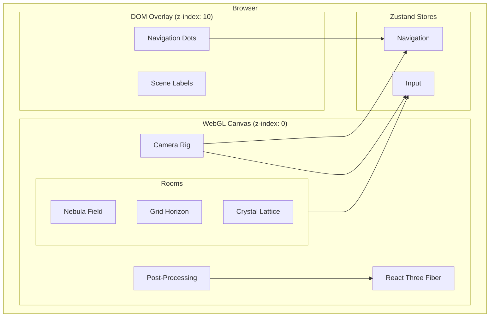
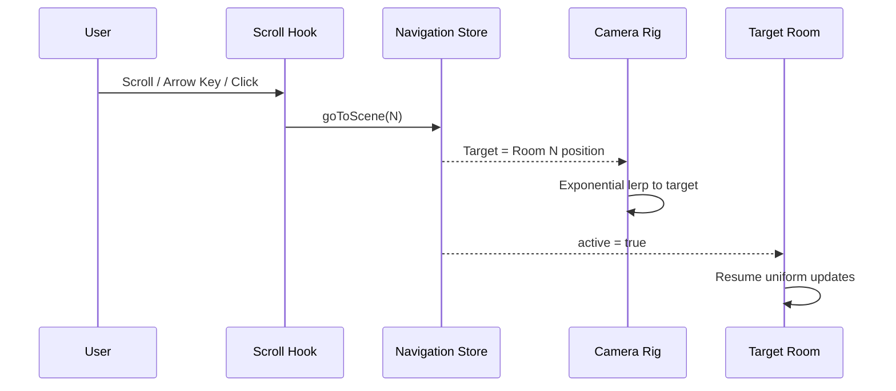
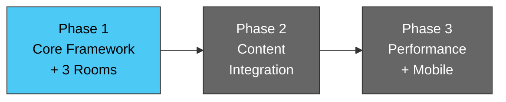

# WebGL Immersive Navigation Framework

A React + Three.js + TypeScript framework that transforms websites into immersive 3D experiences. Users navigate between "rooms" — distinct 3D scenes with custom GLSL shaders, scroll-driven camera animation, and post-processing effects. Inspired by Active Theory's approach.

**This is not "sprinkle WebGL onto a webpage."** The webpage lives inside the WebGL world.

---

## Architecture



### Room Navigation



---

## Tech Stack

| Layer | Technology |
|-------|-----------|
| 3D | Three.js via @react-three/fiber + @react-three/drei |
| Shaders | Custom GLSL (ShaderMaterial only — no built-in materials) |
| Animation | GSAP + ScrollTrigger |
| Scroll | Lenis (smooth momentum scrolling) |
| Post-processing | @react-three/postprocessing (bloom, chromatic aberration, vignette) |
| State | Zustand |
| Build | Vite + vite-plugin-glsl |
| Language | TypeScript strict mode |
| Testing | Vitest + React Testing Library |
| Package Manager | pnpm |

---

## Rooms

### Room 0: Nebula Field
Particle cloud with simplex noise displacement and mouse repulsion. 4000-8000 points with additive blending and soft circles. Two-color gradient driven by per-particle random attribute.

### Room 1: Grid Horizon
Wireframe terrain with layered noise elevation. Mouse position creates a ripple wave. Color mapped to elevation with UV edge fade.

### Room 2: Crystal Lattice
200-400 instanced icosahedrons with per-instance rotation and orbital motion. Fresnel edge glow produces floating crystal field with glowing edges.

---

## Phase Roadmap



| Phase | Focus | Status |
|-------|-------|--------|
| **1** | Renderer, camera, scroll nav, post-processing, 3 rooms | **In Progress** |
| 2 | DOM overlays, content mapping, loading states, 4th room | Planned |
| 3 | Mobile optimization, device detection, accessibility | Planned |

---

## Running Locally

### Without Docker

```bash
pnpm install
pnpm dev        # http://localhost:5173
```

### With Docker

```bash
# macOS / Linux
./run_webgl_frontend.sh

# Windows
run_webgl_frontend.bat
```

The launcher builds and starts the container, then presents a menu:
- `[k]` Stop, keep images
- `[q]` Stop, remove images
- `[v]` Full cleanup (images + volumes)
- `[r]` Full restart (rebuild + relaunch)

---

## Performance Targets

| Metric | Target |
|--------|--------|
| Frame rate | 60fps desktop, 30fps mobile |
| LCP | < 2s |
| Bundle (excl. Three.js) | < 300KB gzipped |
| Draw calls / frame | < 20 |

---

## Project Structure

```
src/
├── components/
│   ├── ui/          # DOM overlay (NavigationDots)
│   └── three/       # R3F components (Experience, CameraRig, rooms, post-processing)
├── hooks/           # useScrollNavigation, useMouseTracking
├── stores/          # Zustand stores (navigation, input)
├── shaders/         # GLSL files (.vert, .frag, .glsl)
│   └── includes/    # Shared GLSL (noise, fresnel)
├── types/           # TypeScript interfaces
└── workers/         # Web Workers (future)
```