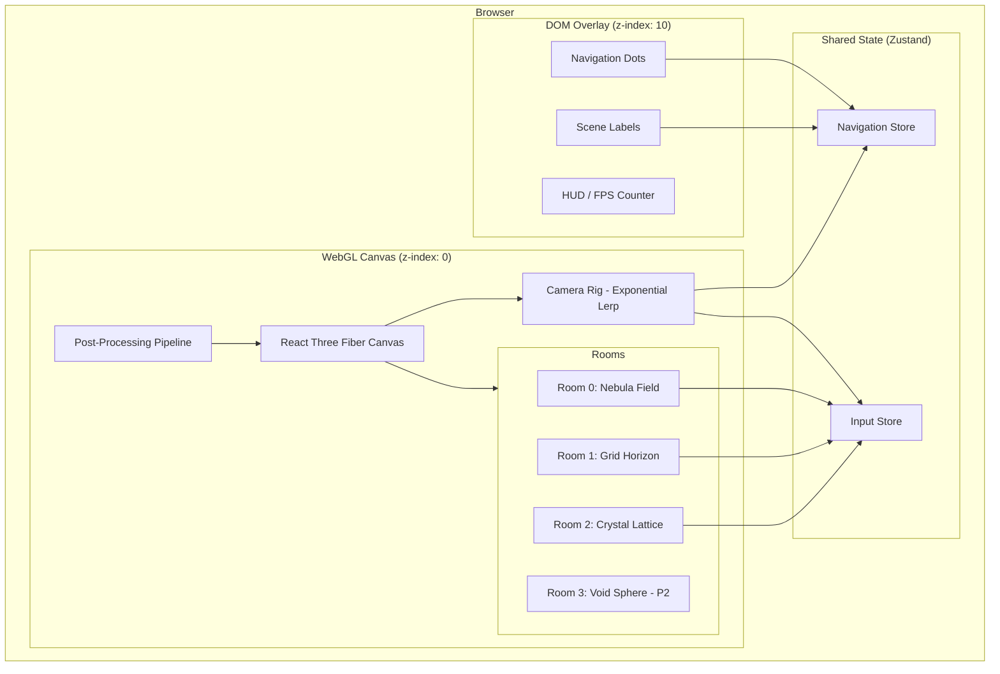
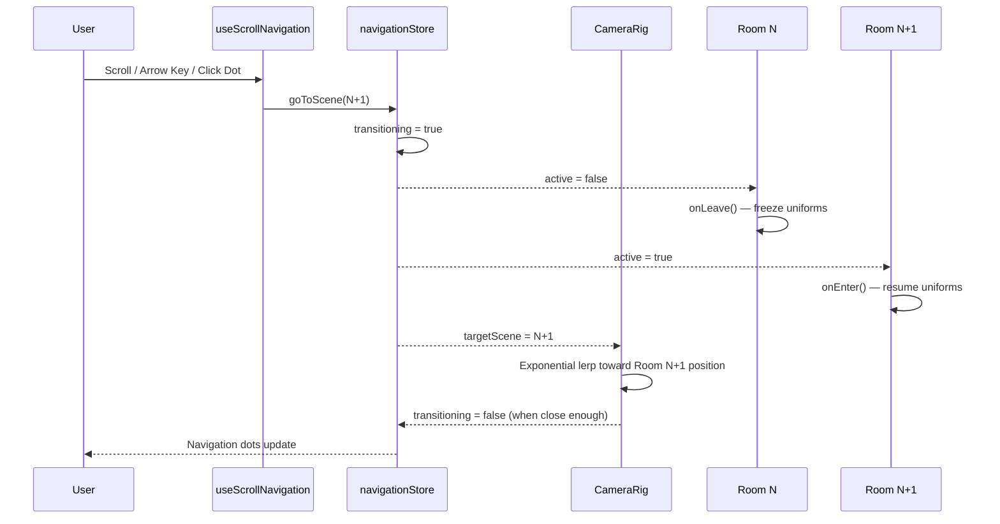
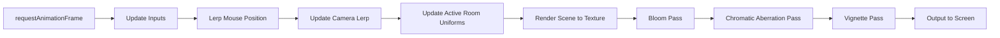
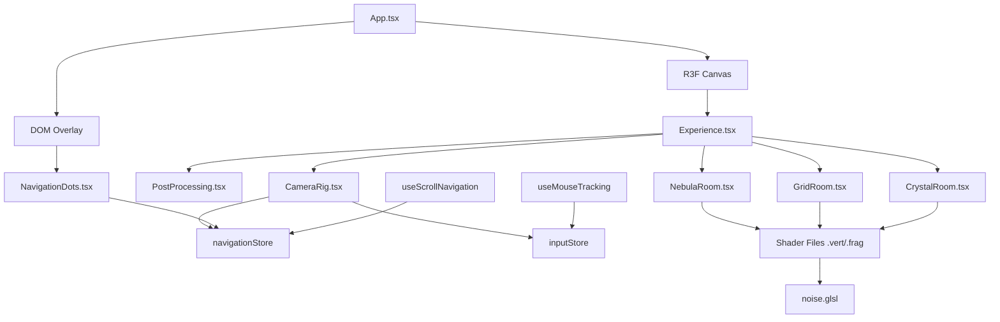
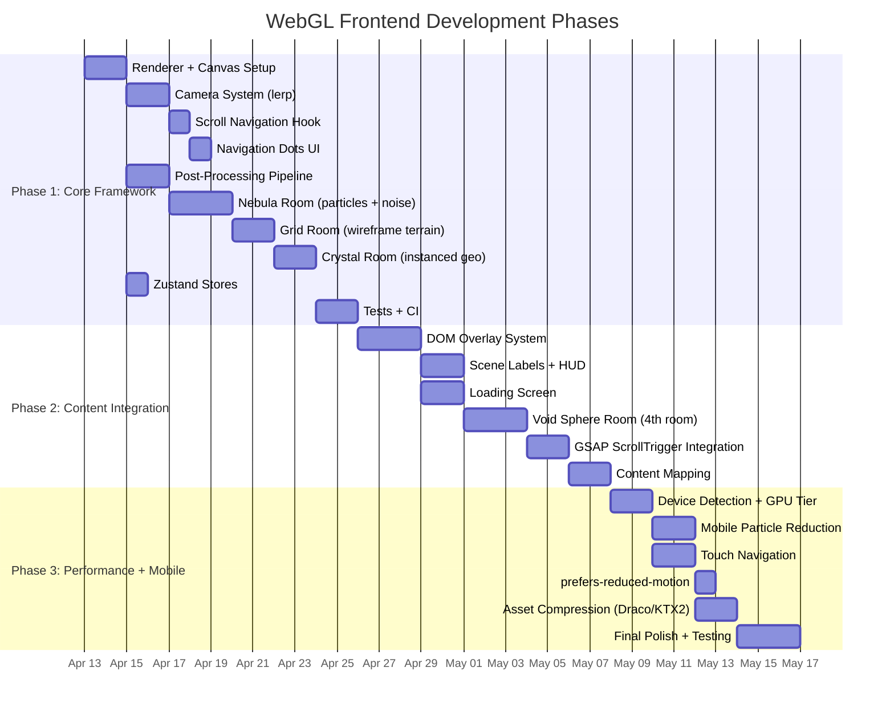

# WebGL Immersive Navigation Framework — Master Plan

## 1. Vision & Motivation

Build an immersive WebGL navigation framework that transforms websites into 3D experiences. Users navigate between "rooms" — distinct 3D scenes with custom GLSL shaders, scroll-driven camera animation, and post-processing effects. Inspired by Active Theory's approach where the webpage lives inside the WebGL world, not the other way around.

### Why This Exists

Standard websites are flat. Active Theory proved that WebGL-powered navigation creates memorable, immersive experiences — but their approach (custom engine Hydra) is not accessible. This project builds the same quality of experience using Three.js + React Three Fiber, making it reusable and extensible.

---

## 2. Architecture

### High-Level System Diagram



### Room Navigation Flow



### Render Pipeline



### Module Dependency Diagram



---

## 3. Technology Choices

| Layer | Technology | Why |
|-------|-----------|-----|
| 3D Framework | Three.js via @react-three/fiber + @react-three/drei | Declarative R3F keeps Three.js lifecycle managed by React. Drei provides common helpers. |
| Shaders | Custom GLSL via ShaderMaterial | Total pixel control. The Active Theory aesthetic requires hand-written shaders — built-in materials cannot produce it. |
| Animation | GSAP + ScrollTrigger | Industry-standard timeline control. ScrollTrigger syncs scroll to animation progress. |
| Scroll | Lenis | Smooth, momentum-based scroll normalization across platforms. |
| Post-processing | @react-three/postprocessing | R3F-native EffectComposer. Bloom, chromatic aberration, vignette. |
| Build | Vite + vite-plugin-glsl | Fast HMR, native ES modules. GLSL plugin enables `import shader from './shader.glsl'`. |
| State | Zustand | Lightweight, works outside React tree (WebGL loop can read without re-renders). |
| Package Manager | pnpm | Fast, disk-efficient. |
| Language | TypeScript strict | No `any`, full type safety. |
| Testing | Vitest + React Testing Library | Fast, Vite-native. |

---

## 4. Phase Breakdown

### Phase Gantt



---

## 5. Phase 1 — Core Framework + 3 Rooms

### Tasks

1. **Renderer + Canvas Setup**
   - R3F `<Canvas>` component with WebGL2
   - Pixel ratio capped at 2.0
   - Full-viewport fixed-position canvas
   - Resize handling (renderer, camera aspect, resolution uniforms)

2. **Camera System**
   - `CameraRig` component using `useFrame`
   - Exponential lerp: `1 - Math.pow(0.04, delta)` (frame-rate independent)
   - Target position driven by `navigationStore.targetScene * ROOM_SPACING`
   - Look-at target lerps in sync

3. **Scroll Navigation**
   - `useScrollNavigation` hook
   - Wheel events (with cooldown to prevent rapid-fire)
   - Arrow key up/down, spacebar
   - Touch swipe (basic — refined in Phase 3)
   - Clamped to `[0, sceneCount - 1]`

4. **Navigation Dots**
   - DOM overlay component
   - Reflects current scene
   - Click-to-jump to any scene

5. **Post-Processing Pipeline**
   - `@react-three/postprocessing` EffectComposer
   - UnrealBloomPass (strength 0.8, radius 0.4, threshold 0.85)
   - Custom vignette + chromatic aberration shader pass

6. **Nebula Room (Room 0)**
   - `THREE.Points` with `BufferGeometry`
   - 4000-8000 particles distributed in a sphere
   - Per-particle attributes: `aRandom`, `aSize`
   - Vertex shader: simplex noise displacement + mouse repulsion
   - Fragment shader: soft circles, two-color mix, additive blending
   - `depthWrite: false`, `AdditiveBlending`

7. **Grid Room (Room 1)**
   - `PlaneGeometry(20, 20, 80, 80)` with `wireframe: true`
   - Vertex shader: layered noise elevation + mouse ripple wave
   - Fragment shader: elevation-mapped color, UV edge fade
   - Rotated ~45deg on X, positioned below camera

8. **Crystal Room (Room 2)**
   - `InstancedBufferGeometry` with `IcosahedronGeometry(0.15, 0)`
   - 200-400 instances with per-instance `aOffset` + `aSeed`
   - Vertex shader: per-instance rotation + orbital motion
   - Fragment shader: fresnel edge glow, two-color seed mix

9. **Shared GLSL Library**
   - `noise.glsl` — Ashima Arts 3D simplex noise
   - Importable via `#include` or `vite-plugin-glsl` pragma

10. **Zustand Stores**
    - `navigationStore` — currentScene, targetScene, transitioning, goToScene
    - `inputStore` — mouse, mouseTarget, scrollProgress, time

### Acceptance Criteria

- Canvas renders 60fps on desktop with all 3 rooms
- Camera transitions are smooth (no teleporting, no jank)
- Each room has a visually distinct shader aesthetic
- Post-processing visibly transforms the look (bloom glow, vignette darkening)
- Navigation works via scroll, keyboard, and dot clicks
- No WebGL errors or console warnings
- All GLSL in separate files

---

## 6. Phase 2 — Content Integration

### Tasks

- DOM overlay system with z-index layering
- Scene labels (title + subtitle) that update on room transition
- HUD (FPS counter, scene indicator)
- Loading screen during initial shader compilation
- Void Sphere room (4th room — noise-displaced icosahedron + glow ring)
- GSAP ScrollTrigger for continuous scroll-to-uniform mapping within rooms
- Content-to-room mapping: each content section becomes room metadata
- CSS/GSAP transition effects during camera moves (fade, dissolve)

### Gate

- 4 rooms rendering with content
- DOM overlays sync with room transitions
- Loading screen hides initial compilation
- Accessible: all text in DOM (screen-reader reachable)

---

## 7. Phase 3 — Performance + Mobile

### Tasks

- GPU tier detection (high/medium/low)
- Particle count reduction on mobile/low-tier
- Post-processing simplification or disabling on low-end
- Touch navigation (swipe with momentum)
- Gyroscope input on mobile (DeviceOrientationEvent)
- `prefers-reduced-motion` respect: disable particles, instant camera
- Draco mesh compression, KTX2 texture compression
- Lazy-load distant rooms
- Bundle analysis and tree-shaking audit

### Gate

- 30fps on mobile devices
- Touch navigation smooth and responsive
- `prefers-reduced-motion` fully respected
- Bundle < 300KB gzipped (excluding three.js)
- LCP < 2s

---

## 8. Cross-Phase Concerns

### Shader Uniform Contract

Every room shader receives these uniforms at minimum:

| Uniform | Type | Description |
|---------|------|-------------|
| `uTime` | `float` | Elapsed time in seconds |
| `uMouse` | `vec2` | Lerped mouse position (-1 to 1) |
| `uResolution` | `vec2` | Viewport width/height in pixels |
| `uProgress` | `float` | Room transition progress (0 to 1) |

Room-specific uniforms (colors, sizes, seeds) are declared per-room.

### Room Interface Contract

Every room component implements:

```typescript
interface RoomProps {
  index: number;
  active: boolean;
  spacing: number;
}
```

And internally:
- Positions its `<group>` at `y = -index * spacing`
- Updates uniforms only when `active` or adjacent
- Disposes all GPU resources on unmount

### State Contract

Zustand stores are the single source of truth for cross-layer communication. Components subscribe to specific slices — never the whole store.

---

## 9. Risks & Mitigations

| Risk | Likelihood | Mitigation |
|------|-----------|------------|
| Shader compilation stalls on first load | High | Phase 2 adds loading screen. Phase 1: accept brief blank frame. |
| Mobile GPU can't handle post-processing | High | Phase 3 adds device detection + graceful degradation. |
| Three.js memory leaks from undisposed objects | Medium | Disposal protocol in CLAUDE.md. Every component cleans up. |
| R3F abstractions limit shader control | Low | ShaderMaterial is fully supported in R3F. No limitation. |
| Bundle size exceeds target with Three.js | Medium | Tree-shake Three.js imports. Analyze bundle in Phase 3. |